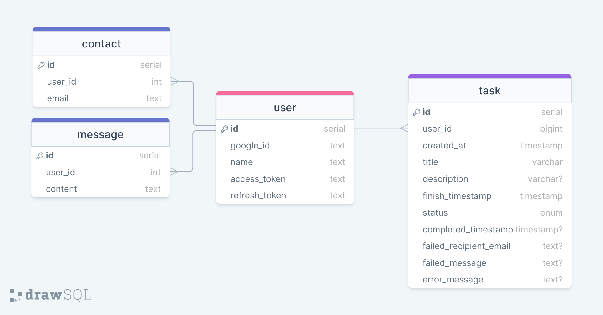
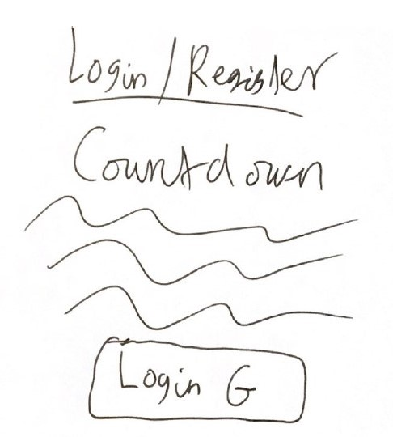
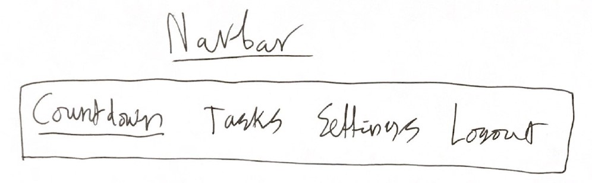
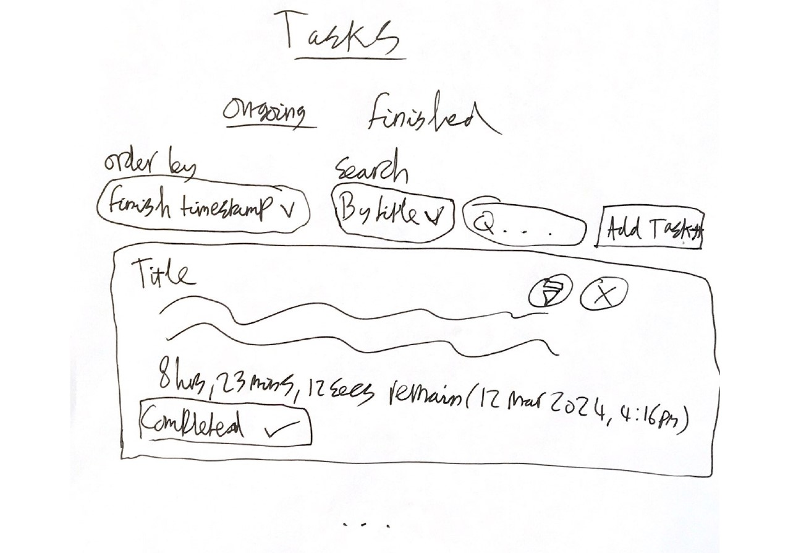
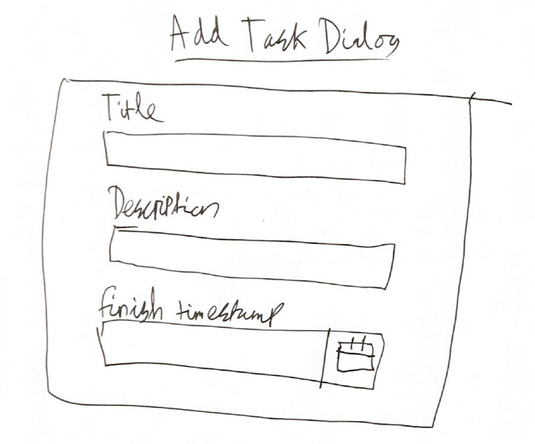
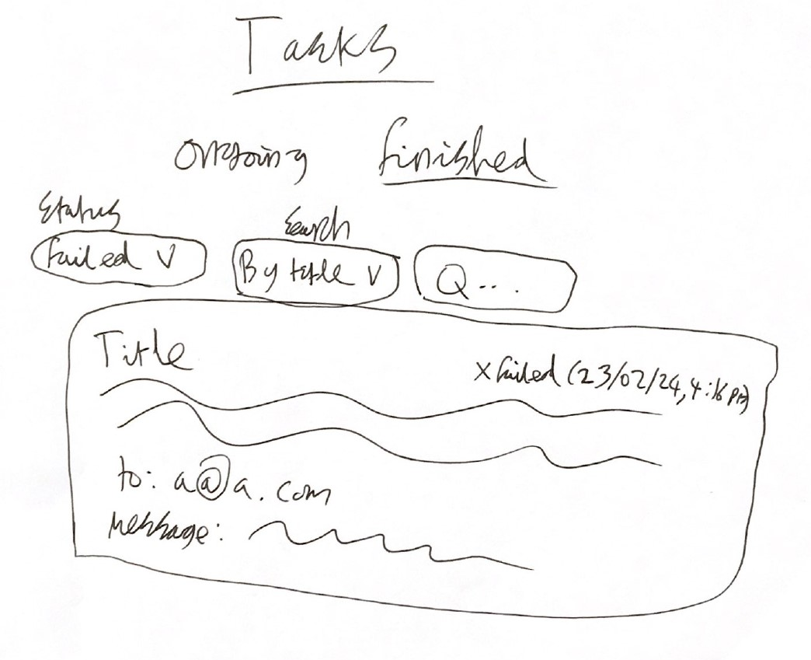
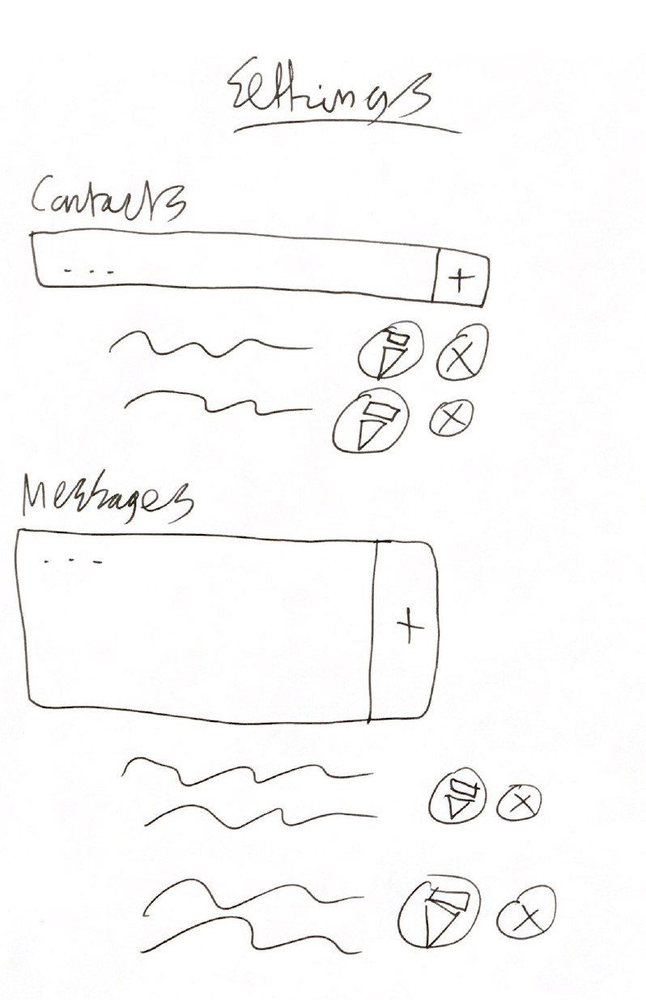

# Countdown
Struggle to get things done? With Countdown you log in with your Gmail, create tasks with deadlines, and if you don't finish them in time we'll send out an embarrassing message from your email account to one of your contacts. If this doesn't keep you motivated, I don't know what will!

## Features
- Login with gmail account
- Customize the contacts and email messages that will be randomly chosen from
- Create tasks that will send out a random embarrassing email if they're not marked as complete in time
- Ability to update and delete ongoing tasks

## Api docs

[https://countdown.jacobcons.com/api-docs](https://countdown.jacobcons.com/api-docs)

## Database layout

## Wireframes

